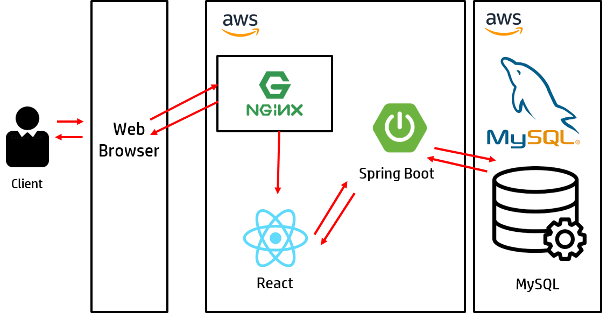

# Unithis (YOU NEED THIS)  
## About UNITHIS

유니디스(UNITHIS)는 물품 교환 플랫폼 서비스입니다. 
🧛 🧄 ↔ 🧥 🧟

- 사용자는 지정한 주소에서 거래를 희망하는 물건들을 확인할 수 있습니다.

- 교환하고 싶은 물건이 있다면, 1:1 채팅을 통하여 소유자와 대화할 수 있습니다.

API docs : [Notion link](https://www.notion.so/856bccf7fcbf45739e95351a2a7f1b4d?v=ab8f79010cb84070bdec92bb6dc7b808) 

[](https://www.youtube.com/watch?v=J-IQdZuJM-U&feature=youtu.be)

## Team

- ##### 김성민 : Back-End Developer  

  - Item, File Upload, Search, DB modeling  

- ##### 김홍주 : Back-End Developer  

  - User, Chat, DB modeling  

- ##### 정영길 : Front-End Developer  

  - Front-End  

## Getting Started

아래와 같이 프로젝트를 clone 합니다.

```
git clone https://github.com/AfterSSAFY/Unithis.git  
```

- ##### Front-End  
  - [주소목록](https://raw.githubusercontent.com/AfterSSAFY/Unithis/051e0c1841d60facb7d1ed0cf3ece5aa6fdda179/frontend/src/utils/address.ts) 파일 다운로드

    ```
    위의 링크에서 주소목폭 파일을 다운로드 받은뒤
        
    frontend/src/utils/ 폴더안에 address.tx이름으로 넣어주세요.
    ```

  - React 16.9.46 

    ```
    VS Code 실행
    yarn start
    ```


- ##### Back-End  

  - Spring Boot 2.3.2.RELEASE (Java 1.8)   

    ```
    STS4 실행
    [File] - [Import] - [Gradle] - [Existing Gradle Project]  
    ```

  - MySQL 8.0 

    ```
    backend 폴더 - .sql 파일 참조
    ```


## Rule

- ##### Front-End  

  - ##### React.js

    - lowerCamelCase  

- ##### Back-End  

  - ##### Java  

    - lowerCamelCase : 지역 변수, private 변수, 메소드, 객체  
    - UpperCamelCase : 클래스명

- ##### Git (feature branch 단위)  

  ##### 기본적으로 첫 글자는 대문자를 사용하며, 마침표를 제외합니다.  

  - ##### FIX : 올바르지 않은 동작을 고친 경우에 사용합니다.  

    > Fix A  : A를 수정합니다.

    ```
    Fix login
    ```

  - ##### ADD : 코드나 테스트, 예제, 문서 등의 추가가 있을 때 사용합니다.

    > Add A : A를 추가합니다.

    ```
    Add error pages
    ```

  - ##### REMOVE : 코드의 삭제가 있을 때 사용합니다.

    > Remove A : A를 삭제합니다.

    ```
    Remove unnecessary login code
    Remove sentences from README.md
    ```

  - ##### REFACTOR : 전면 수정이 있을 때 사용합니다.

    > Refactor A : A를 전면 수정합니다.

    ```
    Refactor argument validation
    Refactor login.XML
    ```

  - ##### UPDATE : 개정이나 버전 업데이트가 있을 때 사용합니다. 코드보다는 주로 문서나 리소스, 라이브러리등에 사용합니다.

    > Update A to B : A를 B하기 위해 업데이트 합니다.

    ```
    Update repo docs to use HTTPS
    ```

  - ##### RENAME : 이름 변경이 있을 때 사용합니다.

    > Rename A to B : A를 B로 이름 변경합니다.

    ```
    Rename login_info to loginInfo
    ```

## Architecture

  

## Project Schedule

  20.08.03 ~ 20.09.05  

## License

This is released under the MIT license. See [LICENSE](./LICENSE) for details.
